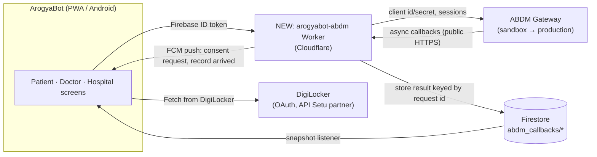

# ArogyaBot — Government Health-Ecosystem Integration Plan

**Covers:** ABHA / ABDM (health records & consent), DigiLocker (documents), Government schemes
**Status:** Draft v1 · 2 Oct 2026 · Owner: ArogyaBot team
**Repo this plan applies to:** `kartikmanarse18-lgtm/tryarogyabot` (web/PWA + Android app) and the Cloudflare SOS Worker

> **How to read this document.** Sections 1–3 explain *what* and *why*. Section 4 is the part you asked for:
> **exactly how each screen and file in the app changes.** Section 7 is the phase-by-phase schedule.
> Facts about ABDM / DigiLocker come from public integrator guides and the official DigiLocker/API Setu pages
> (listed in Appendix C). **Endpoint names, versions and test cases must be confirmed against the official ABDM
> sandbox documentation when each phase starts** — they change, and nothing in this plan has been run against the
> sandbox yet. Effort numbers are my planning estimates, not figures from ABDM.

---

## 1. Why this plan (and why not "Aarogya Setu API")

| Idea | Reality |
|---|---|
| "Use the Aarogya Setu API for documents and schemes" | Aarogya Setu's only documented third-party API (2020) returned a user's **COVID status** only, for organisations with 50+ people. There is **no public Aarogya Setu API** for documents or schemes. Reverse-engineering its private endpoints is out of the question (terms, breakage, legal risk with health data). |
| Where the features really live | **ABDM** (Ayushman Bharat Digital Mission): ABHA ID, health-record exchange, consent. **DigiLocker**: government-issued documents. **Scheme portals** (PM-JAY etc.): information; no public eligibility API found. |

**What ArogyaBot gains:** a patient's verified health identity (ABHA), their records from *any* ABDM-connected hospital/lab
(with their consent), government documents pulled in one tap, and a legally recognised consent flow that replaces the
home-made one in the app today.

---

## 2. Scope: five tracks

| Track | What the user gets | Needs approval from | Effort (rough) | Risk |
|---|---|---|---|---|
| **A. Quick wins** | "Open ABHA app", "Open DigiLocker", official scheme links, better Schemes screen | none | 3–5 days | Low |
| **B. ABHA (ABDM M1)** | Create / link / verify ABHA inside ArogyaBot; ABHA card & QR | ABDM sandbox registration (free) | 2–3 weeks | Medium |
| **C. Health records exchange (M2 provider + M3 user + patient consent centre)** | Prescriptions auto-linked to the patient's ABHA; hospitals request records with the patient's approval; patient pulls outside records into *My Documents* | ABDM sandbox → certification; facility (HFR) & doctor (HPR) registration for production | 8–12 weeks | **High** |
| **D. DigiLocker "Fetch"** | Pull government documents into *My Documents* with consent | DigiLocker **Requester** approval via API Setu (they review eligibility) | 2–3 weeks | Medium |
| **E. Government schemes** | Accurate scheme info + deep links; deeper checks only if a sanctioned API exists | NHA / state agencies (to be investigated) | 1 week + investigation | Low / unknown |

**Recommended order:** A → B → D (parallel with C) → C. Do **not** start C before B works end-to-end in the sandbox.

---

## 3. Target architecture



**Principles**

1. **The app never talks to ABDM directly.** Client IDs/secrets, ABHA access tokens and gateway sessions live **only in the Worker**.
   The browser/APK is public — anything in it is readable.
2. **Callbacks are asynchronous.** ABDM answers many calls later by POSTing to *your* public URL. The Worker receives them,
   writes the result to Firestore under a request id, and the app (listening) updates. We already run a Worker + Firestore + push, so
   this reuses the same pattern as SOS.
3. **Consent notifications reuse the push system built for Android** ("Hospital X requests your records — Approve / Deny").
4. **Feature flags** (`ABDM_ENABLED`, `DIGILOCKER_ENABLED`) so every phase can ship dark and be enabled per build.
5. **No Aadhaar stored by ArogyaBot.** Aadhaar OTP is performed against ABDM; we keep only the resulting ABHA number/address.

### New Worker: `arogyabot-abdm` (separate from the SOS Worker)

| Route | Purpose | Phase |
|---|---|---|
| `POST /abha/aadhaar/otp`, `/abha/aadhaar/verify`, `/abha/mobile/otp`, … | ABHA create / login flows (M1) | B |
| `GET /abha/profile`, `/abha/card` | Profile, ABHA card/QR | B |
| `POST /hip/link-context` + webhook endpoints for discovery/linking | Provider side (M2) | C |
| `POST /hiu/consent-request`, webhook `on-notify`, `on-fetch` | User side (M3) | C |
| `POST /webhooks/abdm/*` | Receive gateway callbacks (public, signature/IP-checked per ABDM docs) | B–C |
| `POST /digilocker/start`, `GET /digilocker/callback` | OAuth start/redirect handling | D |
| Auth on every app-facing route | Verify Firebase ID token (same method as `/api/push/notify`) | B |

State: short-lived secrets/tokens in Worker KV or a Durable Object (never Firestore); results/records metadata in Firestore.
FHIR bundle building and the encryption ABDM requires for record transfer are done **server-side** (details to confirm in the sandbox docs).

---

## 4. HOW THE APP CHANGES

### 4.1 What the user will see (before → after)

| Screen | Today | After |
|---|---|---|
| **Sign-up / profile** | Optional Aadhaar number typed into the profile (stored in profile + Firestore directory) | Optional **"Create or link ABHA"** step. Aadhaar number is **no longer stored**. Profile shows masked ABHA number + ABHA address. |
| **Dashboard** | Blood group, name, etc. | + ABHA card/QR tile ("ABHA linked ✓" or "Create your ABHA") |
| **Medical Records / My Documents** | Manual uploads only; categories Insurance / History / Lab / Other | Three sources, each with a badge: **Uploaded**, **ABHA records** (from other hospitals), **DigiLocker**. "Import" and "Fetch" buttons. Records open in a readable viewer (prescription, lab report, discharge summary). |
| **e-Prescriptions** | Doctor's free-text → patient sees it | Same, plus a **"Shared to ABHA ✓"** badge once linked; structured medicine list |
| **NEW: ABHA & Consents** (nav item) | — | ABHA profile, **pending consent requests (Approve / Deny / limit to dates & record types)**, active consents with **Revoke**, history |
| **Govt. Schemes & Insurance** | Static scheme descriptions + self-declared scheme + Aadhaar field | Same content, refreshed; official links ("Check eligibility on mera.pmjay.gov.in"-style deep links — exact URLs verified at build time); Aadhaar field removed |
| **Hospital console — patient lookup** | Type Aadhaar → patient gets a demo OTP → 15-minute grant | Search by **ABHA number/address** → sends a real **consent request** to the patient's phone → records appear only after approval |
| **Doctor console — write prescription** | One free-text box | Structured rows (medicine, dose, frequency, duration) + optional diagnosis; "Share to patient's ABHA" toggle |
| **Notifications** | Dispatch, prescriptions, etc. | + "Consent requested", "Records received", "Consent expires soon" |

### 4.2 Existing files that change

| File | Change | Phase |
|---|---|---|
| `js/config/app-config.js` | Add `ABDM_WORKER_URL`, `ABDM_ENABLED`, `DIGILOCKER_ENABLED`, `ABDM_ENV` (`'sandbox'`/`'production'`). Secrets stay out of this file. | A–B |
| `index.html` | Add `<script>` tags for the new files (before `main.js`) | B+ |
| `sw.js` | Add new JS files to `APP_SHELL`; bump `CACHE_VERSION` | B+ |
| `js/shell/side-nav.js`, `js/shell/view-dispatch.js` | New patient nav item **`p-abha` "ABHA & Consents"**; hospital/doctor additions below | B |
| `js/auth/aadhaar-and-access-grants.js` (599 lines) | Its own header calls it a **simulation of the ABDM consent-manager pattern**. Changes: (1) keep `isValidAadhaar()` only for format checks; (2) `syncMyAadhaarSharing()` / `aadhaarDirectory` — **stop publishing** Aadhaar-keyed snapshots to Firestore; (3) `hospitalRequestAccess()` → when `ABDM_ENABLED`, create a real ABDM consent request (M3) instead of a local OTP grant; keep the demo path only behind a **"Demo mode"** switch for offline demos; (4) `patientAuthFinishSignup()` → optional ABHA step after account creation. | B, C |
| `js/modules/patient/my-documents.js` (85 lines) | New fields on each doc: `source` (`upload` / `abdm` / `digilocker`), `externalId`, `fetchedAt`, `fhirType`. Add "Import from ABHA" and "Fetch from DigiLocker". **Stop storing the file as a base64 `dataUrl` inside the Firestore document** (see §4.4 — storage prerequisite). | B–D |
| `js/modules/patient/records.js`, `dashboard.js` | ABHA tile; unified record list with source badges | B–C |
| `js/modules/patient/insurance-schemes.js` (129 lines) | Refresh `SCHEME_CONFIG` text; add official links; remove the Aadhaar verification card; keep claim-document checklist | A |
| `js/modules/patient/e-prescriptions.js` | Show "Shared to ABHA ✓" / "Not linked" state; open FHIR-sourced prescriptions | C |
| `js/modules/doctor/doctor-console.js` — `doctorSubmitRx()` | Today writes `{medicines: <free text>}`. Change to structured `items[]` (name, dose, frequency, days) **and** keep a human-readable `medicines` string so pharmacy/delivery code keeps working. After saving, if the patient has a linked ABHA + consent, queue a care-context link/share via the Worker. Needs the doctor's **HPR ID** field. | C |
| `js/modules/hospital/hospital.js` | Hospital profile gets **HFR ID**; patient-lookup UI switches from Aadhaar to ABHA; shows consent status (Requested / Approved / Denied / Expired) | C |
| `js/modules/patient/telemedicine.js` | When a consultation completes, create the care-context (visit) record the prescription attaches to | C |
| `js/auth/family-members.js` | **Each family member has their own ABHA.** ABHA state is stored per member, and switching member must clear any in-memory ABHA/consent views (same pattern already used for the cycle PIN). | B |
| `js/core/account-isolation.js` | Add `'abdm'` to `PRIVATE_ACCOUNT_KEYS` (stores masked ABHA number, address, linked-context list, consent cache — **no tokens**) | B |
| `js/core/notification-center.js` + `js/core/native-bridge.js` | New notification types (`consent_request` etc.) with **Approve / Deny** deep-link into `p-abha`; extend the existing notification-tap handler | C |
| `js/auth/profile-menu.js` | "ABHA & Consents" shortcut | B |
| `scripts/patch-android.py` + `android` manifest | If DigiLocker uses a redirect: add an `intent-filter` for the callback and the `@capacitor/browser` plugin (see §6 risks) | D |
| `firestore.rules` | New paths (below) and later removal of `aadhaarDirectory` | B–C |
| `tests/` | New jsdom tests with a **mocked ABDM Worker** (same style as `native-bridge-test.js`) | every phase |

### 4.3 New files

| File | Purpose |
|---|---|
| `js/services/abdm-client.js` | Thin client: attaches the Firebase ID token, calls the Worker, listens to `abdm_callbacks/{requestId}` |
| `js/modules/patient/abha-health-id.js` | View `p-abha`: create/link flow (Aadhaar-OTP / mobile-OTP), ABHA card & QR |
| `js/modules/patient/consent-center.js` | Pending / active / past consents; Approve / Deny / Revoke |
| `js/modules/doctor/doctor-fhir.js` | Builds FHIR bundles from a prescription (or sends structured data to the Worker to build) |
| `js/modules/hospital/hospital-records-request.js` | Search by ABHA, send consent request, view approved records |
| `js/services/digilocker.js` | "Fetch from DigiLocker" start + result handling |
| `worker-abdm/` (new folder/repo) | The `arogyabot-abdm` Worker (routes in §3) |
| `docs/ABDM_INTEGRATION_PLAN.md` | This file |

### 4.4 Data model & Firestore changes

**Per-patient (private, `users/{uid}/data/abdm` — already covered by the existing `users/{uid}/data/{key}` rule)**
```json
{ "members": { "<memberId>": { "abhaNumberMasked": "XX-XXXX-XXXX-1234", "abhaAddress": "name@abdm",
    "linkedAt": 1790000000000, "consents": [ { "id":"…", "hospital":"…", "status":"granted|requested|denied|revoked|expired",
    "types":["Prescription","DiagnosticReport"], "from":"…", "to":"…" } ] } } }
```
**New collection written by the Worker (service account), read by the owner**
```
abdm_callbacks/{requestId}  → { ownerUid, type, status, payloadRef, createdAt }   // short TTL, cleaned by the Worker
```
Rules sketch: `allow read: if signedIn() && resource.data.ownerUid == request.auth.uid; allow write: if false;` (Worker bypasses rules via service account).

**Prerequisite — document storage.** *My Documents* currently saves each file as a base64 `dataUrl` **inside a Firestore document**,
and Firestore documents are limited to about 1 MiB, so large scans (the UI allows ~4.5 MB) can't sync reliably, and records
imported from ABDM/DigiLocker will be bigger. **Before Track C/D, move binaries to object storage** (Firebase Storage or Cloudflare R2,
with per-user paths and signed URLs) and keep only metadata + a reference in Firestore. This also helps the Android app's performance.

**Retire:** `db('aadhaarDirectory')`, `profile.aadhaarNumber` persistence, and `accessGrants` once Track C is live
(keep read-only for one release, then delete data and the rules for those paths).

---

## 5. Privacy, security & compliance (non-negotiable for real patients)

- **Consent first:** no record moves without a valid ABDM consent artefact (this is also what the sandbox tests check). Patient can revoke any time.
- **Aadhaar:** never stored or logged by ArogyaBot; OTP handled via ABDM. Remove the existing Aadhaar-number field and directory.
- **Secrets & tokens:** only in Worker secrets/KV; never in the repo, the APK or Firestore. Rotate if ever exposed (the Firebase service-account key currently on your PC is already a full-admin key — treat the same way).
- **Logging:** redact ABHA numbers, tokens and record contents in Worker logs.
- **Audit:** extend the existing `audit()` helper: consent requested / granted / revoked, record shared, record viewed (who, when).
- **Legal/regulatory (to be reviewed by a qualified person, not by this plan):** India's DPDP Act, ABDM health-data management policy, Play Store *Health apps* declaration + privacy policy, hospital data-sharing agreements.
- **Pilot only until certified:** passing the sandbox milestones does **not** by itself give production credentials; production needs facility (HFR) and professional (HPR) registrations and ABDM's go-live process.
- **Medical disclaimer** stays visible on AI/health-advice screens.

---

## 6. Risks & open questions

| # | Risk / question | Mitigation |
|---|---|---|
| 1 | **Doctor and delivery accounts are not Firebase Auth users** (they log in with a client-checked password hash). Track C needs doctors to authenticate to the Worker. | Phase 0 decision: migrate doctors to Firebase Auth (preferred), or Worker-issued session tokens after a server-side login. Must be done before C. |
| 2 | Structured prescriptions are a **UX + data change** for doctors (today: one text box). | Keep the free-text field as a fallback "Other instructions"; ship structured rows first behind a flag. |
| 3 | FHIR bundle validation failures cause rework loops (a known time sink in M2). | Build one record type first (OP consultation + prescription), validate early in the sandbox. |
| 4 | DigiLocker's JS "Fetch" button uses a popup/redirect that may misbehave inside the Android WebView. | Prototype early (Phase 4 week 1); fall back to OAuth in the system browser via `@capacitor/browser` + app link callback. |
| 5 | ABDM spec/API versions change. | Pin versions per phase; keep all ABDM calls inside the Worker so the app never needs a release for a spec change. |
| 6 | Free tiers: Worker callbacks, Durable Objects, storage egress. | Watch usage during the pilot; document the upgrade path. |
| 7 | Scheme eligibility has no known public API. | Keep schemes informational; revisit only if NHA/state offers a partner API. |
| 8 | Build vs buy: ABDM aggregators sell ready-made ABDM APIs (e.g. Eka Care's "ABDM Connect"). | Decision in Phase 0 (see §8). Pricing/terms **not verified** — get quotes before deciding. |
| 9 | Production access depends on third parties' timelines, not ours. | Treat production go-live as a separate milestone; the app stays fully usable without it. |

---

## 7. Phased roadmap

> Estimates assume one developer working with Claude, part-time; they exclude third-party approval waiting time.

### Phase 0 — Decisions & prerequisites (3–5 days)
- Decide: direct ABDM integration vs aggregator (§8). Decide doctor-auth approach (Risk 1).
- Register on the **ABDM sandbox**; apply for **DigiLocker Requester** via API Setu (approval can take time — apply now).
- Choose object storage (Firebase Storage vs R2) and plan the document-binary migration.
- **Exit:** sandbox credentials in hand; decisions recorded in this file.

### Phase 1 — Track A quick wins (3–5 days, no approvals)
- Official link/deep-link buttons (ABHA app, DigiLocker, PM-JAY, state schemes) in **Govt. Schemes** and **My Documents**.
- Refresh `SCHEME_CONFIG` copy; add "last reviewed" date; remove the Aadhaar field from the Schemes screen.
- Add `ABDM_*` / `DIGILOCKER_*` flags (all `false`).
- **Exit:** shipped in the next APK; no backend changes.

### Phase 2 — Track B: ABHA (M1) (2–3 weeks)
- Create `arogyabot-abdm` Worker: Firebase-token auth, ABHA create/login, profile, card.
- App: `abdm-client.js`, `abha-health-id.js`, `p-abha` nav item, per-family-member ABHA state, `abdm` private key.
- Remove Aadhaar number persistence (migration note to users).
- **Exit:** all **M1** sandbox test cases pass; a tester creates and links an ABHA from the Android app.

### Phase 3 — Document storage migration (1–2 weeks, can overlap Phase 2)
- Move *My Documents* binaries to object storage; migrate existing `dataUrl` docs; update `sw.js`/rules.
- **Exit:** 10 MB PDF uploads, syncs across two phones, appears on both.

### Phase 4 — Track D: DigiLocker (2–3 weeks, parallel)
- `digilocker.js` + Worker routes; WebView/redirect prototype first (Risk 4).
- Fetched documents land in *My Documents* with `source:'digilocker'`.
- **Exit:** DigiLocker **demo** partner/citizen portals work end-to-end; production approval submitted.

### Phase 5 — Track C: records exchange (8–12 weeks)
1. **Provider (M2):** structured prescriptions → FHIR → care-context linking (`doctor-console.js`, `hospital.js`, `telemedicine.js`).
2. **User + consent (M3):** `consent-center.js`, `hospital-records-request.js`, consent push notifications, retire `accessGrants`.
3. **Patient pulls outside records** into *My Documents* (`source:'abdm'`).
- **Exit:** **M2 and M3** sandbox test cases pass; two-hospital demo: Hospital A writes a prescription → Hospital B requests it → patient approves on phone → B sees it.

### Phase 6 — Production readiness (timeline depends on third parties)
- Real HFR (pilot hospital) / HPR (doctors) registrations; ABDM go-live process.
- Security review, DPDP/privacy policy, Play Store health declarations, load & failure testing, runbooks.
- **Exit:** written go/no-go checklist signed off.

---

## 8. Decisions needed from you

| Decision | Options | My recommendation |
|---|---|---|
| Direct ABDM vs aggregator | Build on ABDM directly (free sandbox, more engineering) · Use a vendor SDK/API (faster, recurring cost, dependency) | Start **direct for M1** to learn the flows; get a vendor quote before M2/M3, because FHIR + encryption is the heaviest part |
| Doctor authentication | Move doctors to Firebase Auth · Worker-issued sessions | Firebase Auth (one auth model everywhere) |
| Object storage | Firebase Storage · Cloudflare R2 | Whichever matches your existing billing plan; R2 pairs naturally with Workers |
| Pilot hospital | Which hospital/clinic registers on HFR and tests M2/M3 with you | Pick one friendly facility early |
| Aadhaar field | Remove now vs after M1 | Remove at M1 launch |

---

## 9. Test plan

- **Unit/mocked (in repo):** jsdom tests with a mocked `arogyabot-abdm` Worker for every new screen and flow (consent approve/deny/revoke, ABHA link, import, per-member switching, flag-off behaviour). Worker tests with faked gateway callbacks (same style as `sos-worker/test/*`).
- **Sandbox:** run every official M1/M2/M3 test case; keep the evidence for certification.
- **Device:** Android matrix (Android 12/13/14, one low-end phone, one Xiaomi/Realme-class phone): ABHA flow, consent push when app is closed (uses the notification system already built), DigiLocker redirect.
- **Security:** token-leak scan of the APK/web bundle; log-redaction check; Firestore rules emulator tests for `abdm_callbacks` and `users/{uid}/data/abdm`.
- **Regression:** existing `npm test` suites (smoke, flow, native bridge) must stay green in CI.

---

## Appendix A — Glossary
**ABDM** Ayushman Bharat Digital Mission · **ABHA** health ID (14-digit number, plus an address like `name@abdm`) · **HIP** Health Information Provider (creates/shares records) · **HIU** Health Information User (requests records) · **PHR** Personal Health Record app (the patient side) · **HFR / HPR** Health Facility / Health Professional Registries · **FHIR R4** the record format ABDM uses · **Care context** a visit/episode a record attaches to · **Consent artefact** the signed, time-boxed permission for a record transfer.

## Appendix B — Mapping ArogyaBot roles to ABDM roles
| ArogyaBot role | ABDM role |
|---|---|
| Patient | PHR user (M1 + M3 patient side) |
| Doctor, Hospital | HIP (M2) and HIU (M3) |
| Pharmacy | HIU for prescriptions (later); optional HIP for dispensing records |
| Responder / Police / Delivery | None (stay outside ABDM) |

## Appendix C — Sources used for this plan (found 2 Oct 2026)
- Aarogya Setu Open API (2020): MediaNama "Aarogya Setu Open API services"; ClearTax News; AWS sample `aws-samples/aws-aarogya-setu-openapi-integration` (marked no longer actively maintained)
- ABDM milestones and sandbox: integrator guides at qualysec.com (ABDM integration checklist), dev.to (ABDM HIP integration in 2026), ecorpit.com, 2basetechnologies.com; ABDM sandbox overview via Drishti IAS
- DigiLocker partner onboarding: `api.apisetu.gov.in` (apply as Issuer/Requester), DigiLocker FAQ (onboarding), Requester API specification v2.1 PDF (`img1.digitallocker.gov.in`), partner workflow PDF (`cdn.apisetu.gov.in`), demo portals `developers.digitallocker.gov.in` / `devpartners.digitallocker.gov.in`
- Aggregator reference (not an endorsement): Eka Care ABDM Connect summary

**Before building each phase, re-read the current official ABDM and DigiLocker documentation — this plan intentionally does not copy endpoint details.**

---

## Appendix D — Compatibility rule (added 2 Oct 2026, decided by the owner)

**Nothing in the existing app is removed or replaced until the new ABDM/DigiLocker flow is completely ready, tested and approved by the owner.**

- All new code is additive: new files, or new sections behind flags that default to **off** (`ABDM_ENABLED`, `DIGILOCKER_ENABLED`). With flags off the app behaves exactly as it did before.
- This overrides every "remove / retire / replace" line earlier in this plan (Aadhaar field, `aadhaarDirectory`, `accessGrants`, free-text prescriptions, `dataUrl` documents). Those items move to a final **Phase 7 — Retire old structure**, which needs the owner's explicit go-ahead, a backup of the old data, and a rollback plan.
- Every phase must keep `npm test` green, including `tests/phase1-test.js`, which asserts that the old Aadhaar flow, access-grant functions, document upload and prescription code still exist.
- Firestore rules change by **addition only** until Phase 7.

## Appendix E — Phase 1 status (2 Oct 2026)

Done: flags added (all off); official-links cards on Government Schemes and My Documents (PM-JAY eligibility, Maharashtra MJPJAY, ABHA, DigiLocker); PM-JAY text now mentions the 70+ Vay Vandana cover, CGHS text notes the choice rule; "last reviewed" dates; `tests/phase1-test.js`.
Deliberately NOT done (per Appendix D): removing the Aadhaar field from the Schemes screen.
Not done because unverified: an "Open ABHA app" deep link (needs the app's confirmed package id). Scheme facts above come from secondary sources — confirm on official sites before relying on them.
